<h1 align="center">gunh0 (Gunho Park)</h1>

**🇰🇷 Introduction (Profile): <https://gunh0.github.io/profile>**

**[💼 Curriculum Vitae (CV)](https://github.com/gunh0/curriculum-vitae/blob/master/main/cv.pdf)**

**I am committed to becoming an expert equipped with the powerful tool of <kbd>&nbsp;⚒️ Development&nbsp;</kbd> and the strategic blueprint of <kbd>&nbsp;🛡️ Cybersecurity&nbsp;</kbd>, seamlessly integrating both to create a robust defense against evolving threats. My primary focus lies in <kbd>&nbsp;📊 Data-driven Security&nbsp;</kbd>, where insights derived from data guide decision-making processes to enhance the overall security posture.**

**Furthermore, I am actively engaged in advancing my expertise in the realm of <kbd>&nbsp;🔄 DevSecOps&nbsp;</kbd>, with a specialized emphasis on securing environments within the `Cloud` and `DevOps` landscapes. Recognizing the dynamic nature of these domains, I am dedicated to staying at the forefront of technology trends and implementing security measures that align with the principles of `CI` · `CD` · `Collaboration`.**

 

  

 

## 🗂️ Featured Projects

**A hand-picked collection of finished, documented projects.**

<!-- FEATURED:START -->

  

  

<b>&#128209; Text version with clickable links</b>

 

#### 🔐 Security & DevSecOps 

<kbd>&nbsp;01&nbsp;</kbd>&ensp;<a href="https://github.com/gunh0/kr-vulhub"><b>kr-vulhub</b></a>&ensp;
 
&emsp;&emsp;Docker-compose-based vulnerable environments for hands-on exploitation and verification (Korean edition of Vulhub)

<kbd>&nbsp;02&nbsp;</kbd>&ensp;<a href="https://github.com/gunh0/whs-utils"><b>whs-utils</b></a>&ensp;
 
&emsp;&emsp;Essential utilities for conducting classes in the WhiteHat School security education program

<kbd>&nbsp;03&nbsp;</kbd>&ensp;<a href="https://github.com/gunh0/aws-security-hub"><b>aws-security-hub</b></a>&ensp;
 
&emsp;&emsp;Go-based CSPM tool automating security audits of AWS resources against Security Hub controls

<kbd>&nbsp;04&nbsp;</kbd>&ensp;<a href="https://github.com/gunh0/azure-security-hub"><b>azure-security-hub</b></a>&ensp;
 
&emsp;&emsp;CLI tool for inspecting and monitoring the security posture of Azure resources

<kbd>&nbsp;05&nbsp;</kbd>&ensp;<a href="https://github.com/gunh0/openstack-security-hub"><b>openstack-security-hub</b></a>&ensp;
 
&emsp;&emsp;Security compliance checker for OpenStack environments, written in Go

<kbd>&nbsp;06&nbsp;</kbd>&ensp;<a href="https://github.com/gunh0/os-security-hub"><b>os-security-hub</b></a>&ensp;
 
&emsp;&emsp;Automated security auditing and hardening toolkit for multiple operating systems

<kbd>&nbsp;07&nbsp;</kbd>&ensp;<a href="https://github.com/gunh0/tor-network-analyzer"><b>tor-network-analyzer</b></a>&ensp;
 
&emsp;&emsp;Docker-based analyzer for Tor hidden services with a real-time web dashboard

<kbd>&nbsp;08&nbsp;</kbd>&ensp;<a href="https://github.com/gunh0/malware-image-classification"><b>malware-image-classification</b></a>&ensp;
 
&emsp;&emsp;CNN model classifying grayscale binary images as ransomware or benign

#### 🤖 AI & LLM Engineering 

<kbd>&nbsp;09&nbsp;</kbd>&ensp;<a href="https://github.com/gunh0/kr-mcp-from-scratch"><b>kr-mcp-from-scratch</b></a>&ensp;
 
&emsp;&emsp;Korean hands-on guide to MCP, RAG, and project context management

<kbd>&nbsp;10&nbsp;</kbd>&ensp;<a href="https://github.com/gunh0/llm-quota-monitor"><b>llm-quota-monitor</b></a>&ensp;
 
&emsp;&emsp;Terminal dashboard for real-time quota monitoring across Claude Code, Codex &amp; Kiro

<kbd>&nbsp;11&nbsp;</kbd>&ensp;<a href="https://github.com/gunh0/reinforcement-learning-q-learning-gymnasium"><b>reinforcement-learning-q-learning-gymnasium</b></a>&ensp;
 
&emsp;&emsp;Tabular Q-learning walkthroughs with Gymnasium, from a visual route planner to Taxi-v3

#### ⚙️ Systems & Infrastructure 

<kbd>&nbsp;12&nbsp;</kbd>&ensp;<a href="https://github.com/gunh0/pcap-tracking"><b>pcap-tracking</b></a>&ensp;
 
&emsp;&emsp;Real-time network packet capture and monitoring system built with Go + Next.js and live WebSocket updates

<kbd>&nbsp;13&nbsp;</kbd>&ensp;<a href="https://github.com/gunh0/linux-system-programming"><b>linux-system-programming</b></a>&ensp;
 
&emsp;&emsp;C examples for processes, file systems, memory, and IPC, plus security vulnerability demos in Docker

<kbd>&nbsp;14&nbsp;</kbd>&ensp;<a href="https://github.com/gunh0/windows-system-programming"><b>windows-system-programming</b></a>&ensp;
 
&emsp;&emsp;Windows system programming from the perspective of synchronous and asynchronous I/O

<kbd>&nbsp;15&nbsp;</kbd>&ensp;<a href="https://github.com/gunh0/docker-hadoop-cluster"><b>docker-hadoop-cluster</b></a>&ensp;
 
&emsp;&emsp;Dockerized Hadoop cluster with HDFS and YARN for local development and testing

<kbd>&nbsp;16&nbsp;</kbd>&ensp;<a href="https://github.com/gunh0/ml-dataset-automation-aws"><b>ml-dataset-automation-aws</b></a>&ensp;
 
&emsp;&emsp;Automated ML dataset serving using Docker containers on AWS

<kbd>&nbsp;17&nbsp;</kbd>&ensp;<a href="https://github.com/gunh0/merkle-tree"><b>merkle-tree</b></a>&ensp;
 
&emsp;&emsp;Merkle tree implementation in Go

#### 📚 Foundations 

<kbd>&nbsp;18&nbsp;</kbd>&ensp;<a href="https://github.com/gunh0/algorithms"><b>algorithms</b></a>&ensp;
 
&emsp;&emsp;Solutions for algorithm problems in C/C++

<!-- FEATURED:END -->

 

  

