<h1 align="center">gunh0 (Gunho Park)</h1>

  
  

**I am committed to becoming an expert equipped with the powerful tool of <kbd>&nbsp;⚒️ Development&nbsp;</kbd> and the strategic blueprint of <kbd>&nbsp;🛡️ Cybersecurity&nbsp;</kbd>, seamlessly integrating both to create a robust defense against evolving threats. My primary focus lies in <kbd>&nbsp;📊 Data-driven Security&nbsp;</kbd>, where insights derived from data guide decision-making processes to enhance the overall security posture.**

**Furthermore, I am actively engaged in advancing my expertise in the realm of <kbd>&nbsp;🔄 DevSecOps&nbsp;</kbd>, with a specialized emphasis on securing environments within the <kbd>&nbsp;☁️ Cloud&nbsp;</kbd> and <kbd>&nbsp;♾️ DevOps&nbsp;</kbd> landscapes. Recognizing the dynamic nature of these domains, I am dedicated to staying at the forefront of technology trends and implementing security measures that align with the principles of <kbd>&nbsp;🔁 CI&nbsp;</kbd> <kbd>&nbsp;🚀 CD&nbsp;</kbd> <kbd>&nbsp;🤝 Collaboration&nbsp;</kbd>.**

  

 

  

 

## 🗂️ Featured Projects

**A hand-picked collection of finished, documented projects.**

<!-- FEATURED:START -->

  

  <a href="https://github.com/gunh0/kr-vulhub"></a>
  <a href="https://github.com/gunh0/whs-utils"></a>
  <a href="https://github.com/gunh0/aws-security-hub"></a>
  <a href="https://github.com/gunh0/azure-security-hub"></a>
  <a href="https://github.com/gunh0/openstack-security-hub"></a>
  <a href="https://github.com/gunh0/os-security-hub"></a>
  <a href="https://github.com/gunh0/tor-network-analyzer"></a>
  <a href="https://github.com/gunh0/malware-image-classification"></a>
  <a href="https://github.com/gunh0/kr-mcp-from-scratch"></a>
  <a href="https://github.com/gunh0/llm-quota-monitor"></a>
  <a href="https://github.com/gunh0/reinforcement-learning-q-learning-gymnasium"></a>
  <a href="https://github.com/gunh0/pcap-tracking"></a>
  <a href="https://github.com/gunh0/linux-system-programming"></a>
  <a href="https://github.com/gunh0/windows-system-programming"></a>
  <a href="https://github.com/gunh0/docker-hadoop-cluster"></a>
  <a href="https://github.com/gunh0/ml-dataset-automation-aws"></a>
  <a href="https://github.com/gunh0/merkle-tree"></a>
  <a href="https://github.com/gunh0/algorithms"></a>

<!-- FEATURED:END -->
